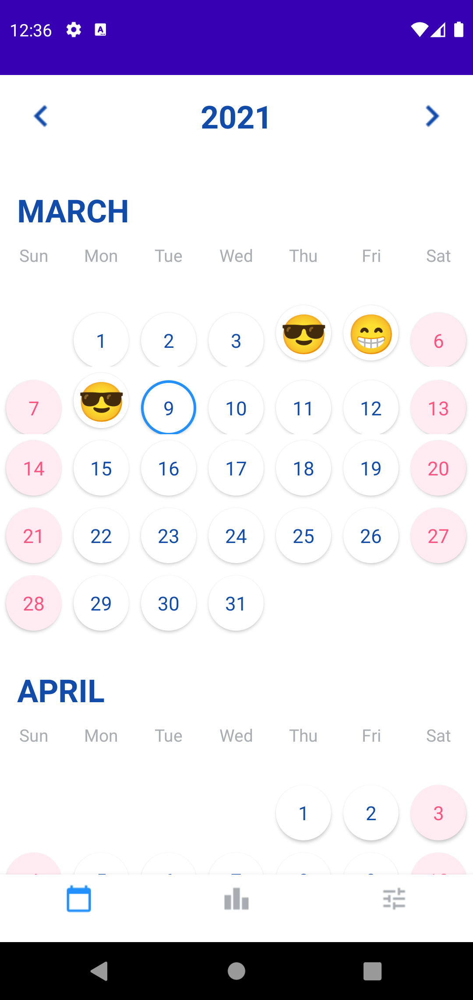
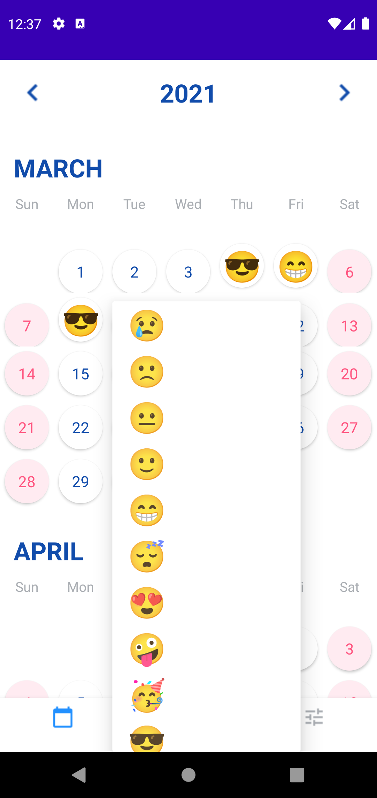
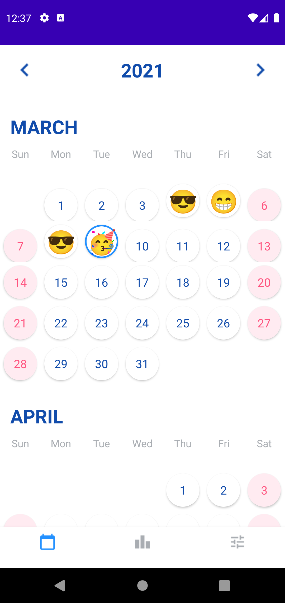
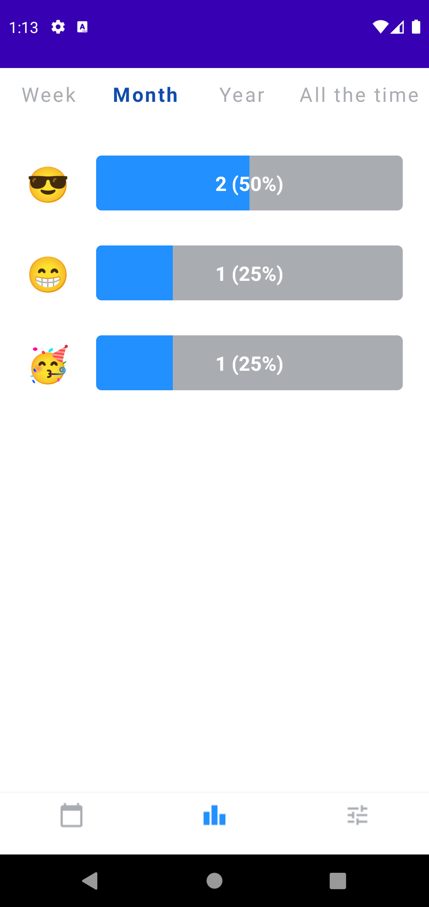

# Mood Tracker
An Android app to track your daily mood.
You can
* Pick a mood everyday
* Use emojis to sumarize your daily mood
* Navigate between years and months and visualize the former moods
* View weekly, monthly, yearly or all time statistics

### Phone display:

 

   

## Library

* [Kizitonwose's CalendarView](https://github.com/kizitonwose/CalendarView)
* [Emoji Compatibility](https://developer.android.com/guide/topics/ui/look-and-feel/emoji-compat)
* [Room Persistence Library](https://developer.android.com/training/data-storage/room)
* [Kotlin coroutines](https://developer.android.com/kotlin/coroutines)
* [Navigation](https://developer.android.com/guide/navigation)
* [Bottom navigation](https://material.io/components/bottom-navigation/android)

## App Architecture
* MVVM
* Kotlin

## Design

The app design is based on the [mood tracking UX case study](https://uxdesign.cc/ux-case-study-1d741a0d5eee) by Mac Kozal

## Developed By

Paulo Sabaini