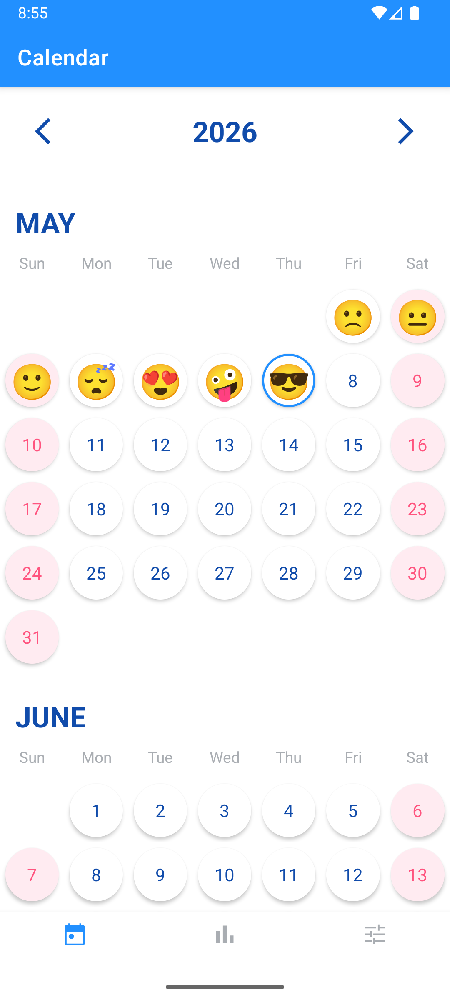
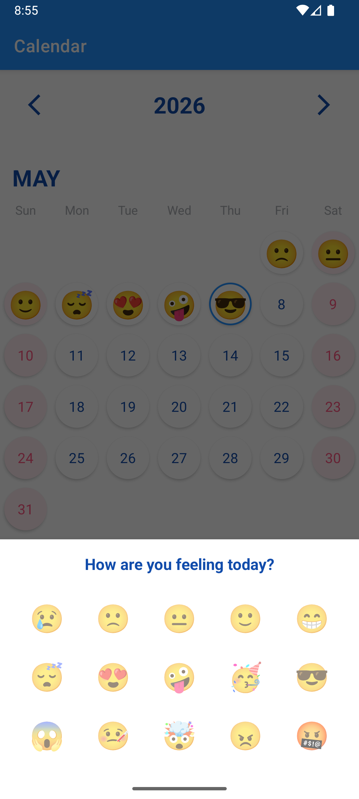
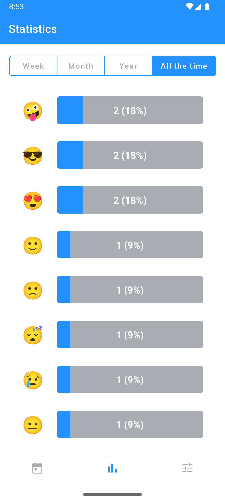
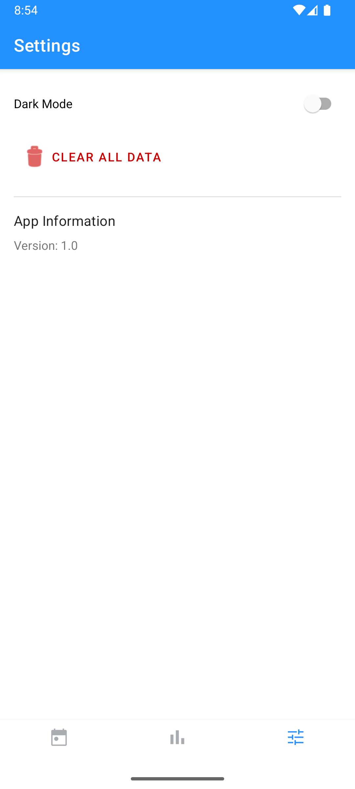

# Mood Tracker 📊

[](https://kotlinlang.org)
[](https://developer.android.com)
[](LICENSE)

An elegant and minimalist Android application designed to help you track and visualize your daily mood patterns.

## ✨ Features

*   **Daily Mood Selection:** Quickly log your mood every day with a simple and intuitive interface.
*   **Emoji Summaries:** Use expressive emojis to capture the essence of your day.
*   **Historical View:** Navigate through years and months to review your emotional journey.
*   **Rich Statistics:** Gain insights with weekly, monthly, yearly, and all-time mood distribution charts.
*   **Calendar Integration:** A beautiful calendar view to see your mood history at a glance.

## 📱 Screenshots

<p align="center">
  
  
  
  
</p>

## 🛠 Tech Stack

*   **Language:** [Kotlin](https://kotlinlang.org/)
*   **UI Framework:** XML (DataBinding)
*   **Architecture:** MVVM (Model-View-ViewModel) with Clean Architecture principles.
*   **Dependency Injection:** [Hilt](https://developer.android.com/training/dependency-injection/hilt-android)
*   **Database:** [Room Persistence Library](https://developer.android.com/training/data-storage/room)
*   **Asynchronous Work:** [Kotlin Coroutines](https://developer.android.com/kotlin/coroutines) & Flow
*   **Navigation:** [Jetpack Navigation Component](https://developer.android.com/guide/navigation)
*   **Calendar Library:** [Kizitonwose's CalendarView](https://github.com/kizitonwose/CalendarView)
*   **Local Storage:** [DataStore](https://developer.android.com/topic/libraries/architecture/datastore) for preferences.

## 🏗 App Architecture

The app follows the recommended Android architecture guidelines:

*   **Presentation Layer:** Uses MVVM pattern with `ViewModel` and `LiveData`/`Flow`.
*   **Domain Layer:** Contains business logic and Use Cases.
*   **Data Layer:** Manages data from local Room database and preferences.

## 🚀 Getting Started

### Prerequisites

*   Android Studio Hedgehog or newer.
*   JDK 17.
*   Android SDK 24+.

### Installation

1.  Clone the repository:
    ```bash
    git clone https://github.com/yourusername/mood-tracker.git
    ```
2.  Open the project in Android Studio.
3.  Wait for Gradle sync to complete.
4.  Run the app on an emulator or a physical device.

## 🎨 Design Credits

The app design is inspired by the [Mood Tracking UX Case Study](https://uxdesign.cc/ux-case-study-1d741a0d5eee) by Mac Kozal.

## 📄 License

This project is licensed under the MIT License - see the [LICENSE](LICENSE) file for details.
